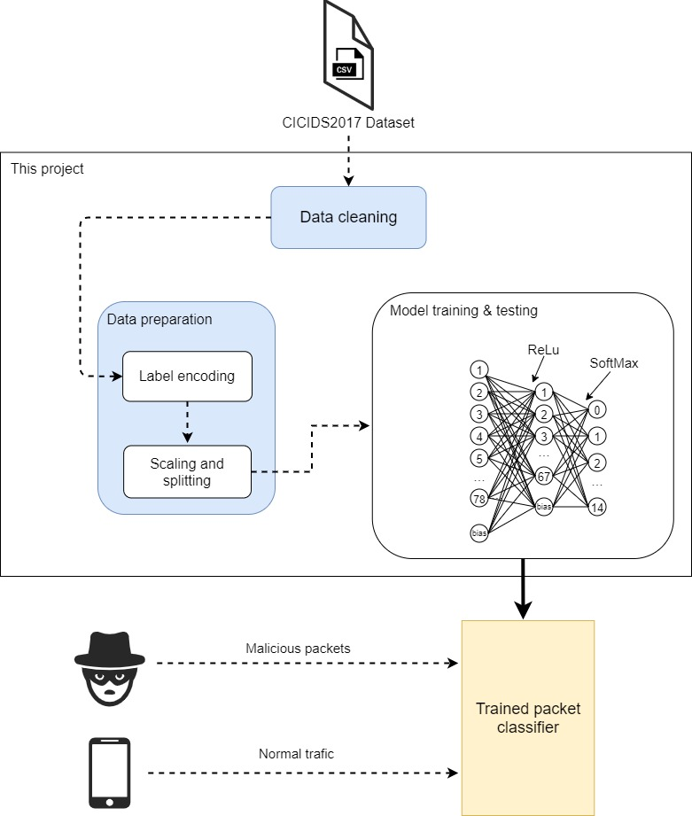

# Anomaly-based Intrusion Detection System

This project was made for Information Systems Security class. Goal was to use neural network classifier for predicting network and web attacks.

This project is more of a _proof-of-concept_ for the usage of FFBP neural network classifiers in IDSs, then a final working product.

Dataset we used to achieve this goal is [CICIDS2017](https://www.unb.ca/cic/datasets/ids-2017.html) dataset made by Canadian Institute for Cybersecurity, University of New Brunswick.
Dataset contains network traffic data during normal traffic and during execution of different attacks.

## Built with

Project was made with standard Python ML tools such as: _pandas, sklearn, tensorflow 2.0 and keras._

## Pipeline

Main part of ML pipeline is the neural network classifier built with _tensorflow 2.0._.

    

